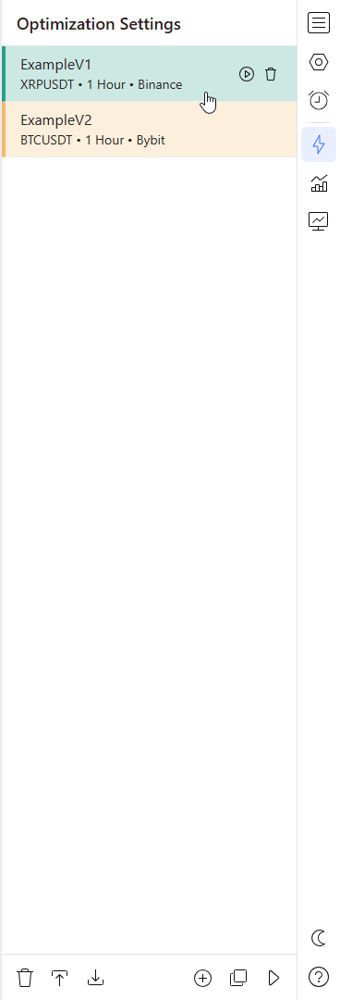
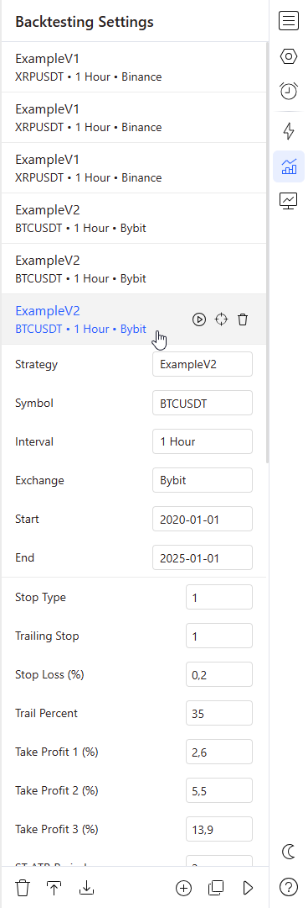
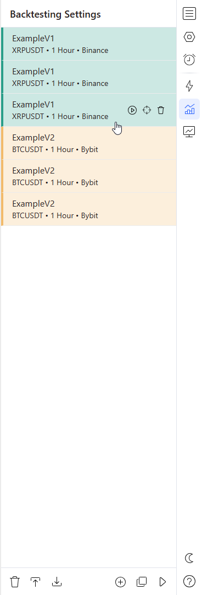
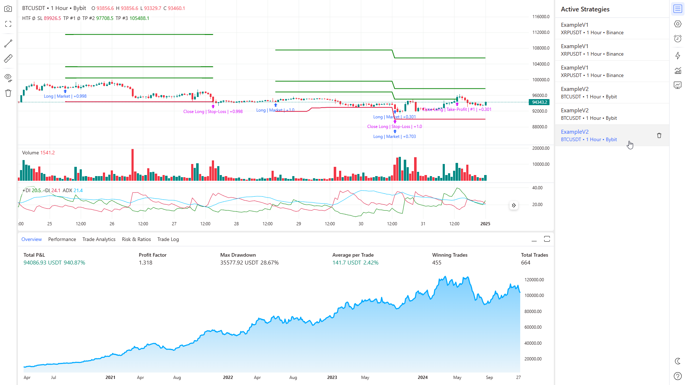
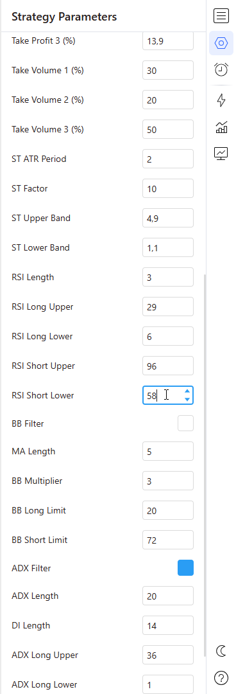
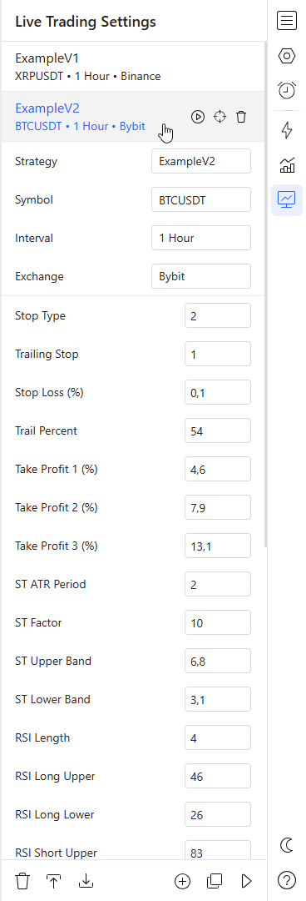
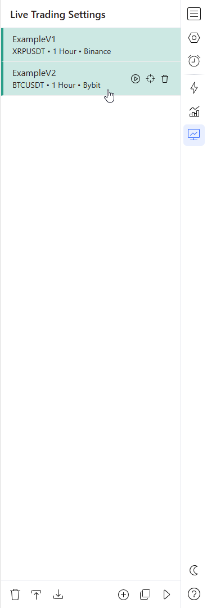
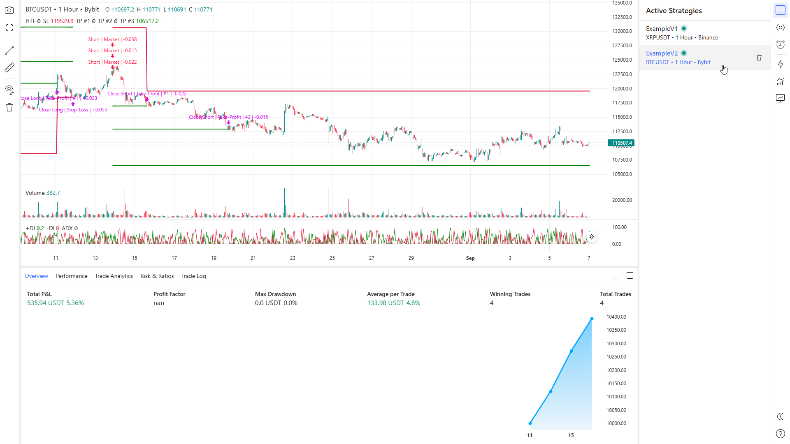
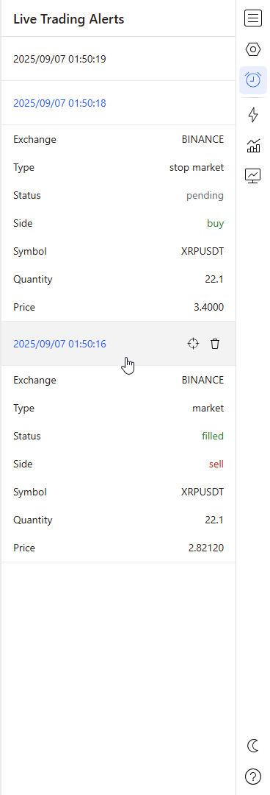

# Built-in Strategies Guide

This guide explains how to use the built-in strategies of **Jinn** across three core phases: optimization, backtesting, and live trading.

## Table of Contents

- [Getting Started](#getting-started)
- [Optimization](#optimization)
- [Backtesting](#backtesting)
- [Live Trading](#live-trading)
- [Best Practices](#best-practices)
- [Troubleshooting](#troubleshooting)

---

## <a id="getting-started"></a> 🚀 Getting Started

### Launching the Application

To start **Jinn**, navigate to the project directory and execute the following command:

```bash
poetry run python run.py
```

Once the application starts successfully, open your web browser and navigate to the provided address. By default, this will be `http://127.0.0.1:1001` (unless you've modified the `SERVER_PORT` or `BASE_URL` settings in your `.env` file).

### Strategic Workflow

**Jinn** follows a systematic three-phase approach:

- 📈 **Optimization** — Identify strategy parameters to maximize profitability.
- 🔍 **Backtesting** — Evaluate strategies on historical data with robust metrics.
- 🤖 **Live Trading** — Run and manage strategies in real-time market environments.

---

## <a id="optimization"></a> 🔧 Optimization

The optimization phase discovers optimal parameter combinations by systematically testing configurations against historical data.

### 1. Configure Optimization Settings

Open the _Optimization Settings_ tab in the right panel of the interface. Add a new configuration by clicking the corresponding button at the bottom of the tab. Configure the settings according to your preferences: select a strategy, symbol, timeframe, exchange, as well as start and end dates for the chart data. Create additional configurations as needed.

> **Note:** Configurations can be deleted, imported/exported, and cloned for convenience.

<div align="center">


</div>

### 2. Run Optimization Process

After successfully configuring your settings, launch optimization for one configuration (using the button on each configuration) or run all configurations simultaneously (by clicking the corresponding button at the bottom of the tab). The configuration colors will change to yellow, indicating that the application has begun optimizing the strategies. Upon completion, the corresponding configuration will turn green for successful optimization or red if problems occurred (such as incorrectly configured parameters).

<div align="center">



</div>

### 3. Access Optimization Results

Optimization results become immediately available in the _Backtesting Settings_ and _Live Trading Settings_ tabs.

---

## <a id="backtesting"></a> 📊 Backtesting

The backtesting phase evaluates optimized strategies using historical data to validate their performance.

### 1. Configure Backtesting Settings

Open the _Backtesting Settings_ tab in the right panel of the interface. Add a configuration by clicking the corresponding button at the bottom of the tab. Configure the settings according to your requirements: select a strategy, symbol, timeframe, exchange, start and end dates for the chart data, and adjust strategy parameters. If the configuration was created through optimization, it's recommended to modify the start and end dates to test the strategy's generalization ability and avoid overfitting. Create additional configurations as needed.

> **Note:** Configurations can be deleted, imported/exported, and cloned for convenience.

<div align="center">



</div>

### 2. Execute Backtesting

After successfully configuring your settings, launch backtesting for one configuration (using the button on each configuration) or run all configurations simultaneously (by clicking the corresponding button at the bottom of the tab). The configuration colors will change to yellow, indicating that the application has begun preparing data and executing the strategies. Upon completion, the corresponding configuration will turn green for successful execution or red if problems occurred (such as incorrect configuration parameters). To easily match configurations with active strategies, each configuration has a crosshair button. Click this button to open the corresponding strategy on the chart.

<div align="center">



</div>

### 3. Analyze Backtesting Results

Switch to the _Active Strategies_ tab where all prepared strategies will appear. Click on strategy card to open the corresponding strategy in the interface. This allows you to examine the strategy's behavior on the chart and view trading statistics in the bottom panel of the interface.



### 4. Adjust Strategy Parameters

The _Strategy Parameters_ tab in the left panel of the interface allows you to modify parameters of the current strategy in real-time.

> **Note:** Changing parameters in the configuration does not affect the parameters of the currently active strategy.

<div align="center">



</div>

---

## <a id="live-trading"></a> 🤖 Live Trading

Live Trading mode executes strategies in real-time with live market data, sending actual orders to exchanges.

### 1. Configure Live Trading Settings

Open the _Live Trading Settings_ tab in the right panel of the interface. Add a configuration by clicking the corresponding button at the bottom of the tab. Configure the settings according to your requirements: select a strategy, symbol, timeframe, exchange, and adjust strategy parameters. If the configuration was created through optimization, additional configuration changes are typically not required.

> **Note:** Configurations can be deleted, imported/exported, and cloned for convenience.

<div align="center">



</div>

### 2. Launch Live Trading

After successfully configuring your settings, launch live trading for one configuration (using the button on each configuration) or run all configurations simultaneously (by clicking the corresponding button at the bottom of the tab). The configuration colors will change to yellow, indicating that the application has begun preparing data and executing the strategies. Upon completion, the corresponding configuration will turn green for successful execution or red if problems occurred (such as incorrect configuration parameters). To easily match configurations with active strategies, each configuration has a crosshair button. Click this button to open the corresponding strategy on the chart.

<div align="center">



</div>

### 3. Monitor Live Trading Strategies

Switch to the _Active Strategies_ tab where all prepared strategies will appear. Click on strategy card to open the corresponding strategy in the interface, allowing you to monitor strategies trading in real-time. Trading statistics are also available in the bottom panel of the interface. Additionally, you can modify strategy parameters using the _Strategy Parameters_ tab, changing the strategy's behavior in real-time.

> **Note:** Strategies currently in live trading mode have a green indicator on their cards.



### 4. Monitor Trading Alerts

The _Live Trading Alerts_ tab will display notifications from strategies executing real trading operations on exchanges.

<div align="center">



</div>

---

## <a id="best-practices"></a> 📝 Best Practices

### Strategy Development Workflow

1. **Always Optimize First:** Never skip the optimization phase to ensure optimal parameter selection.
2. **Use Out-of-Sample Testing:** Validate performance on unseen historical data to avoid overfitting.
3. **Consider Market Regimes:** Ensure the strategy works across different market conditions and volatility levels.
4. **Parameter Sensitivity Analysis:** Test how sensitive your strategy is to small parameter changes.

### Risk Management

1. **Start Small:** Use minimal capital for new strategies until proven successful.
2. **Monitor Drawdowns:** Set acceptable risk thresholds and stop strategies exceeding limits.
3. **Diversify:** Avoid relying on a single strategy, symbol, or market condition.
4. **Regular Monitoring:** Check performance and system health at least once per day.
5. **Position Sizing:** Implement proper position sizing based on account balance and risk tolerance.

### System Maintenance

1. **Keep APIs Updated:** Regularly verify exchange connectivity and API key validity.
2. **Update Dependencies:** Keep all Python packages and system components current.
3. **Backup Configurations:** Save successful parameter sets and configuration files.
4. **Monitor Resources:** Ensure sufficient CPU, memory, and disk space for operations.
5. **Log Analysis:** Regularly review application logs for warnings or errors.

### Performance Optimization

1. **Data Quality:** Ensure historical data is complete and accurate before optimization.
2. **Realistic Assumptions:** Account for slippage, fees, and execution delays in backtesting.
3. **Walk-Forward Analysis:** Periodically re-optimize strategies on recent data.
4. **Market Adaptation:** Be prepared to adjust or retire strategies as market conditions change.

---

## <a id="troubleshooting"></a> 🛠️ Troubleshooting

### Common Configuration Issues

#### Strategy Not Loading

- Verify all fields are filled in the configuration.
- Check that the selected symbol is available on the chosen exchange.
- Ensure date ranges are valid and contain sufficient data.
- Confirm the strategy module is properly installed and accessible.

### Runtime Issues

#### Strategy Not Executing Trades

- Ensure sufficient account balance for the intended position size.
- Check API credentials have the required trading permissions enabled.
- Verify the trading symbol is correctly formatted for the exchange.
- Confirm the strategy logic generates valid trading signals.

#### Poor Performance Results

- Reassess optimization parameters and date ranges.
- Check for overfitting by testing on different time periods.
- Consider recent changes in market conditions or volatility.
- Analyze if the strategy assumptions remain valid.

### Technical Problems

#### Connection Issues

- Test internet connection stability and speed.
- Verify exchange API status and server availability.
- Review firewall settings and network restrictions.
- Check for VPN or proxy interference with API connections.

#### Interface Problems

- Try accessing the interface from a different browser.
- Ensure JavaScript is enabled in your browser settings.
- Check for browser console errors and report them.

### Getting Help

1. **Check Application Logs:** Review log files for detailed error messages and debugging information.
2. **Verify Configuration:** Double-check all settings against the documentation examples.
3. **Documentation Review:** Ensure you're following the latest workflow procedures and best practices.

---

**🎯 Ready to Trade?**  
Start with backtesting and small position sizes to validate your strategies before deploying them with real capital.
