# Screenshots Gallery

This gallery showcases the **Jinn** interface in both light and dark themes.

## Table of Contents

- [Light Theme](#light-theme)
- [Dark Theme](#dark-theme)
- [Workflow](#workflow)

---

##  Light Theme

#### Full Interface Overview

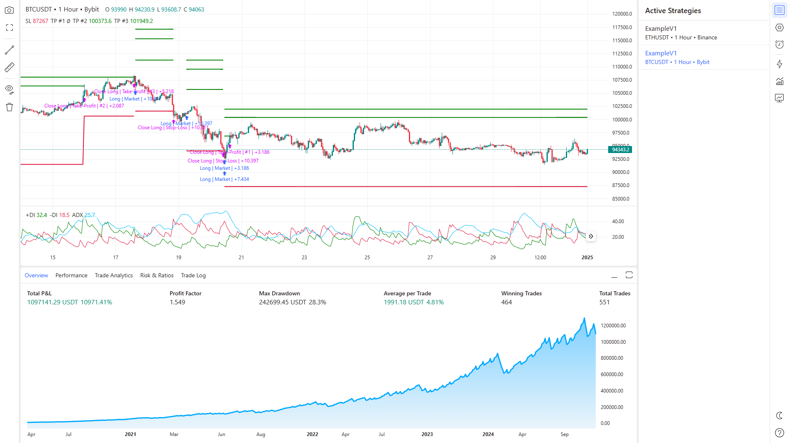

#### Report Overview Panel

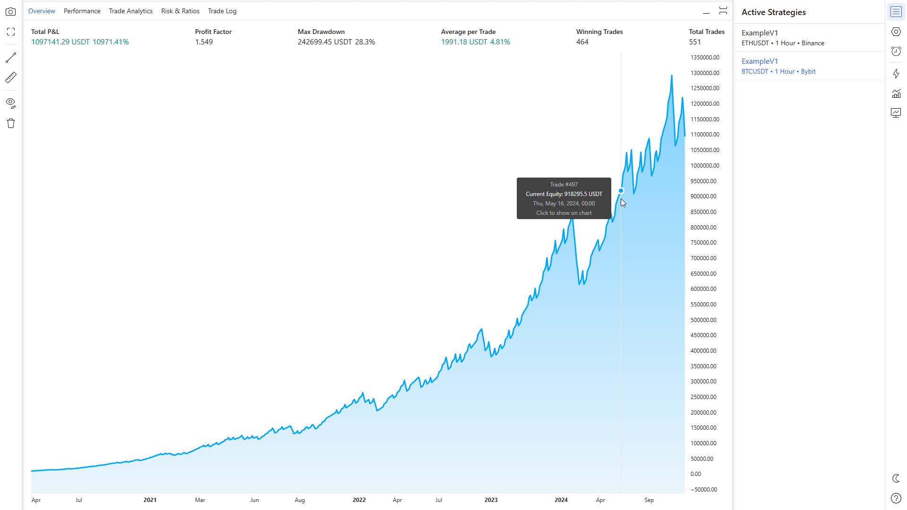

#### Performance Metrics Panel

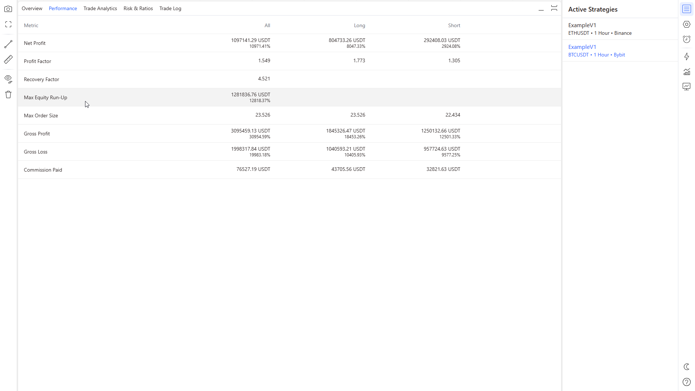

#### Trade Analytics Panel

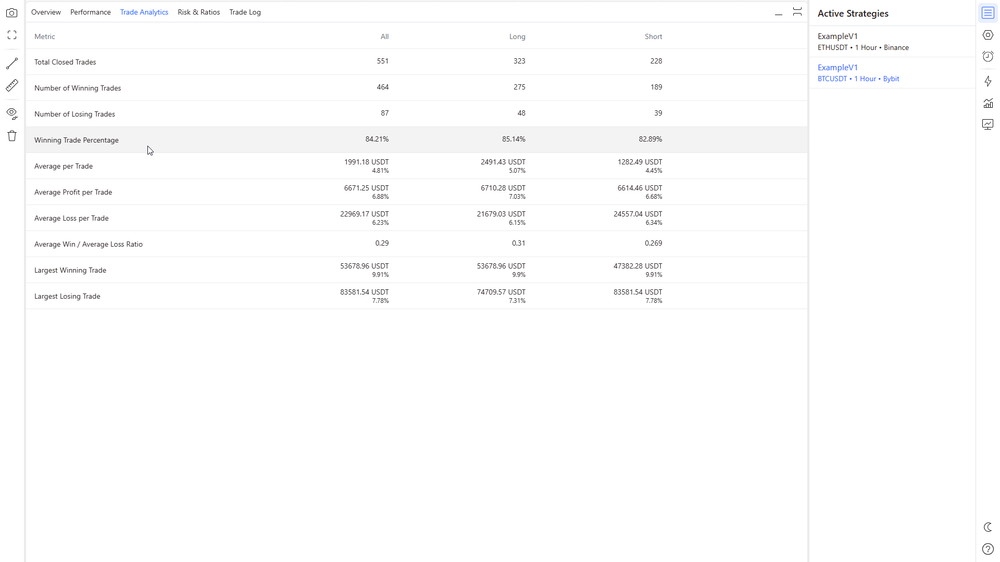

#### Risk & Ratios Panel

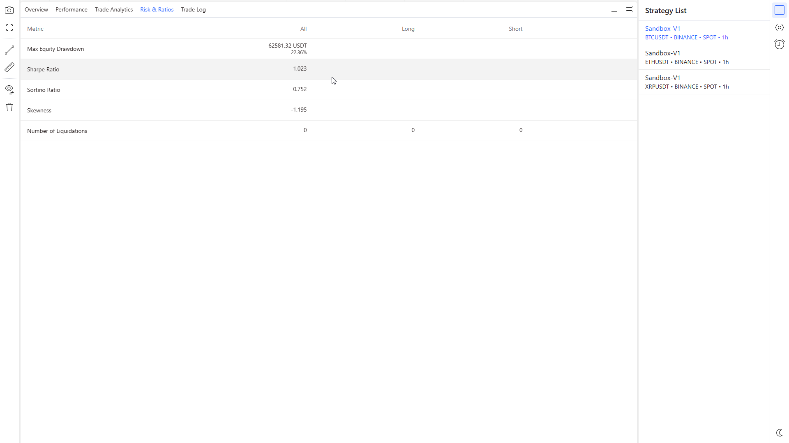

#### Trade Log Panel

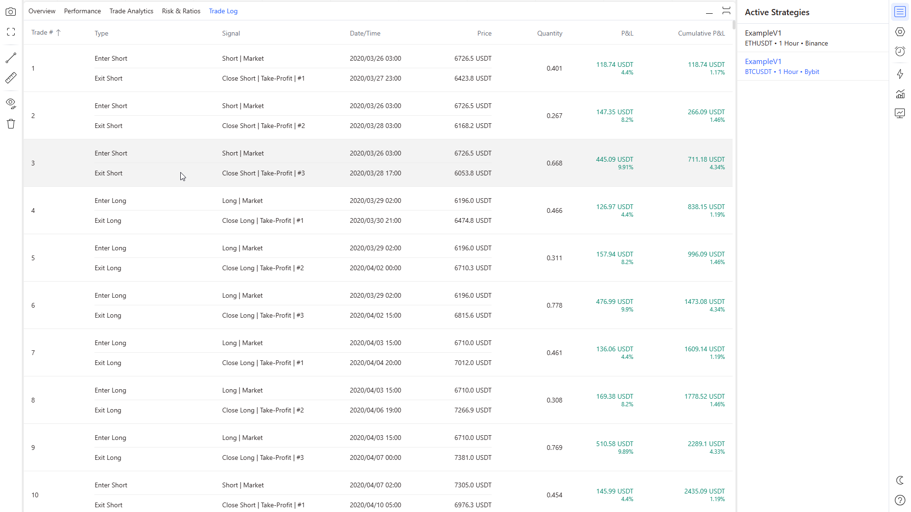

#### Chart Panel

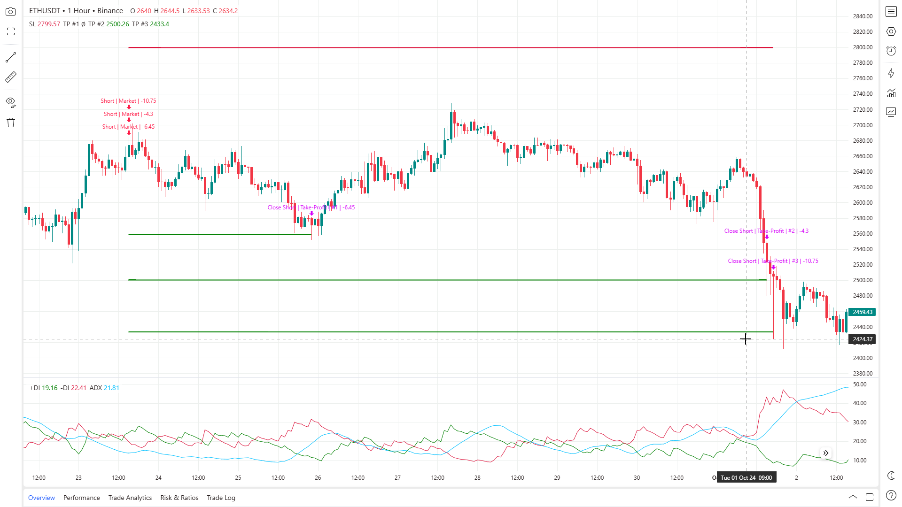

#### Chart with Ruler Tool

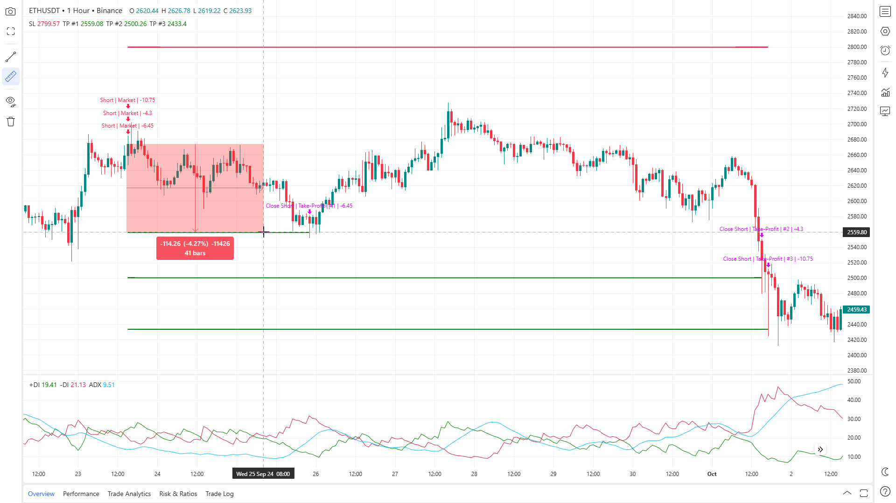

#### Chart with Trendline

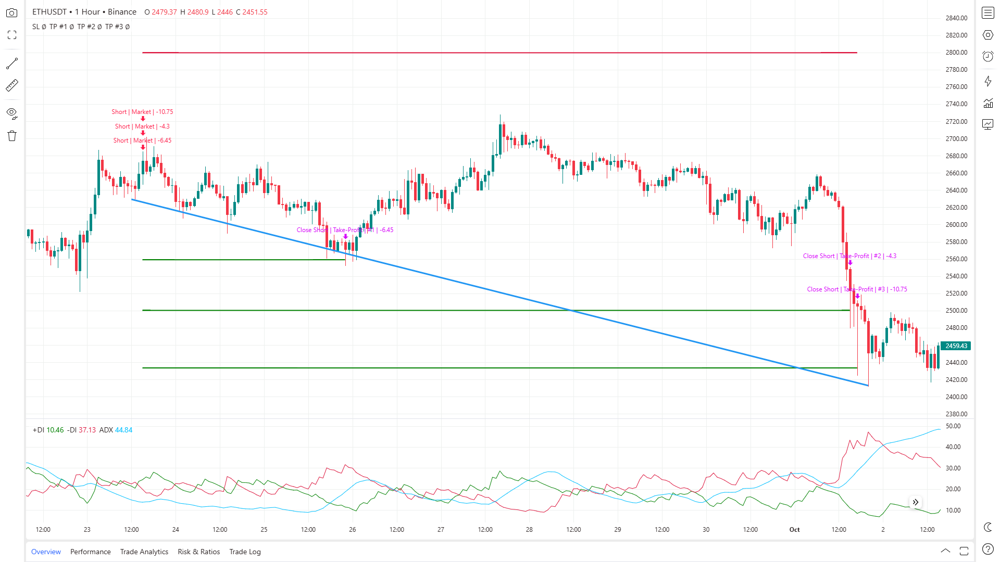

---

##  Dark Theme

#### Full Interface Overview

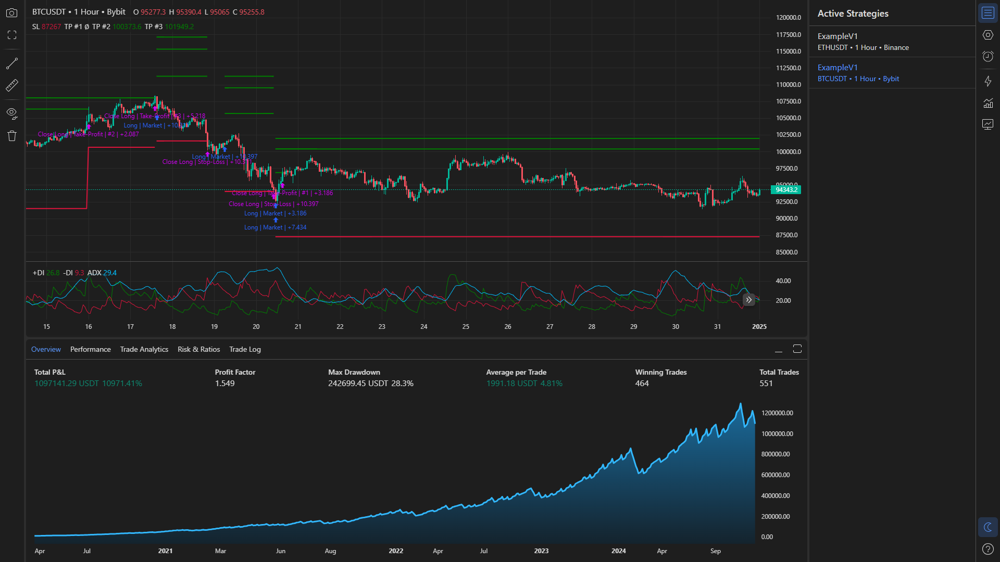

#### Report Overview Panel

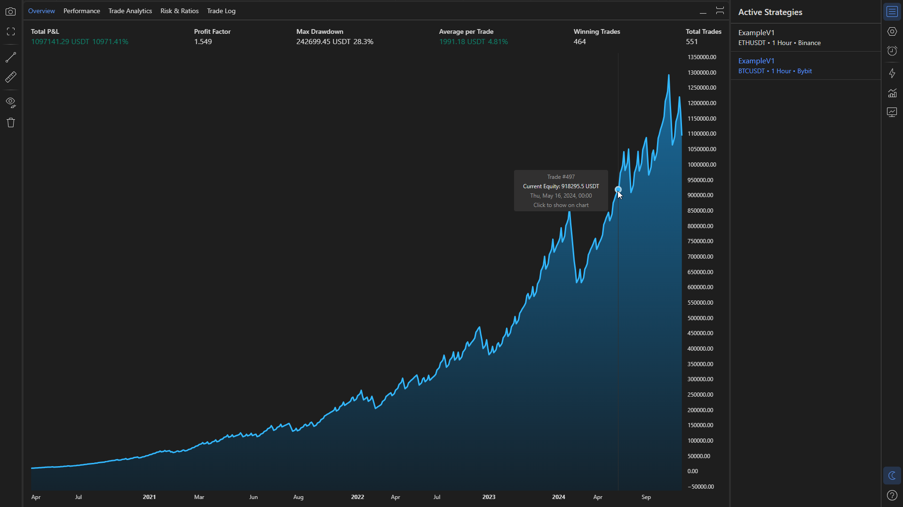

#### Performance Metrics Panel

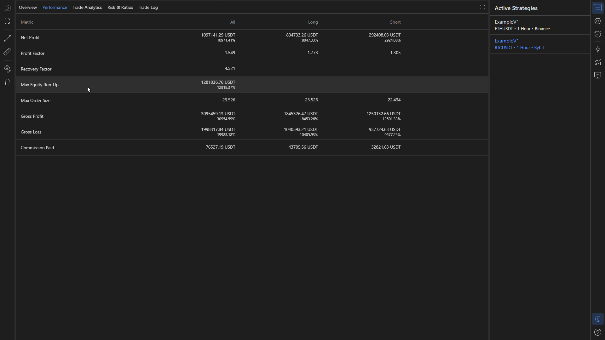

#### Trade Analytics Panel

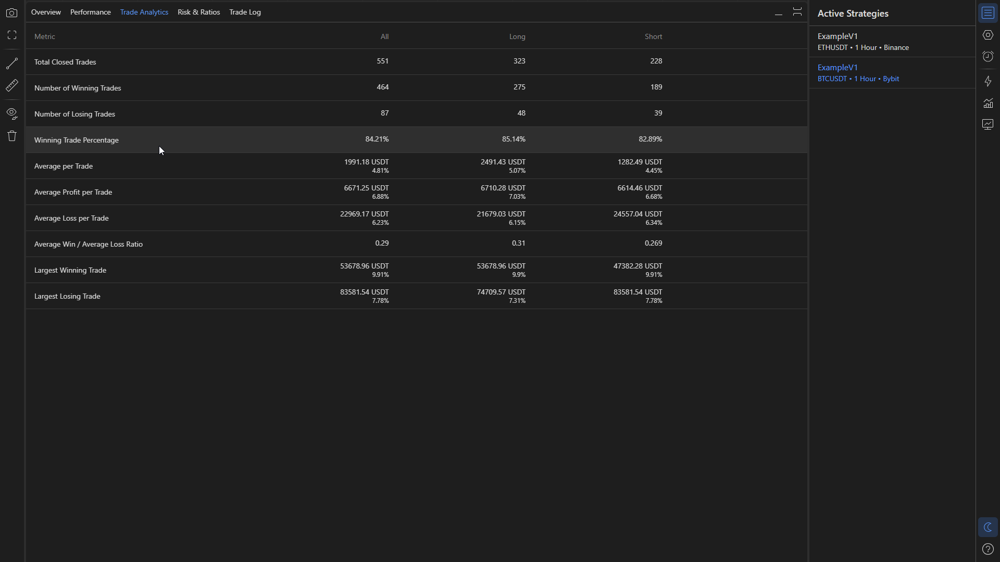

#### Risk & Ratios Panel

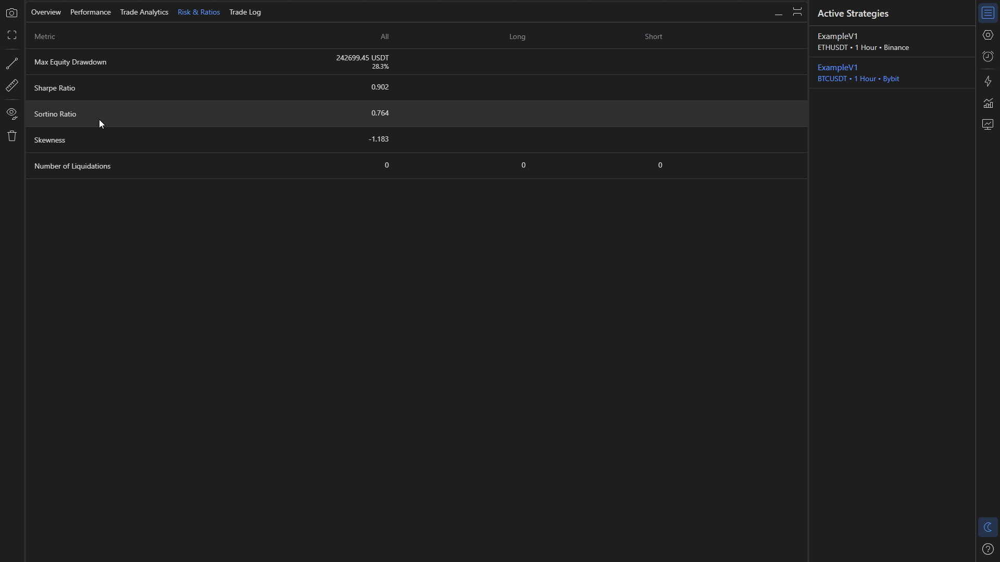

#### Trade Log Panel

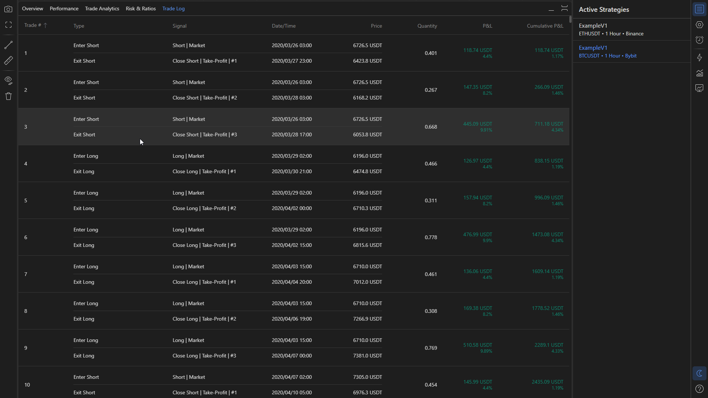

#### Chart Panel

#### Chart with Ruler Tool

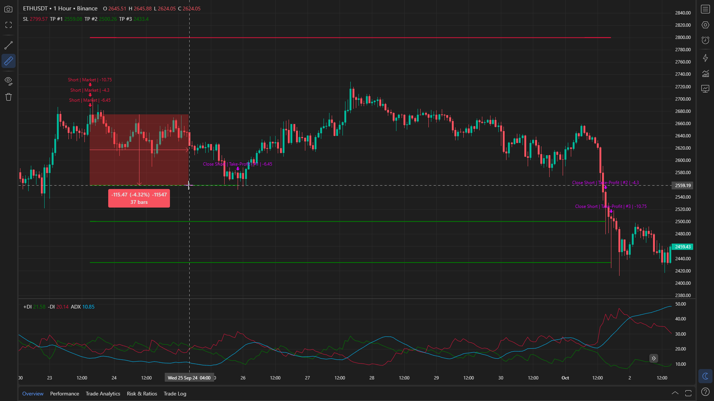

#### Chart with Trendline

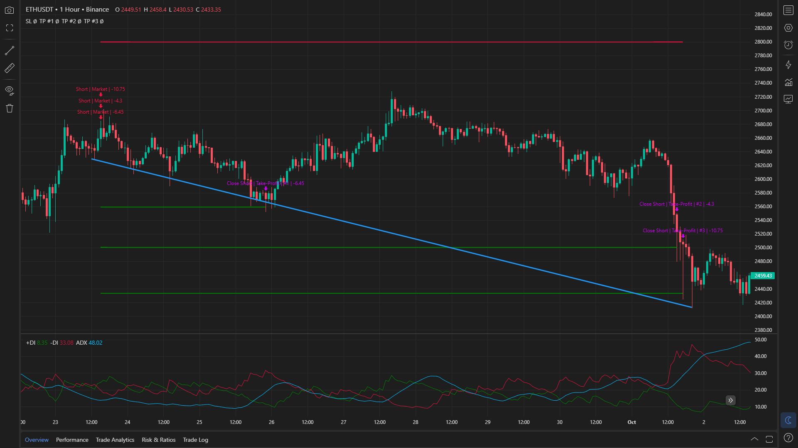

---

##  Workflow

#### Optimization Settings Configuration

#### Optimization Process in Progress

#### Backtesting Settings Configuration

#### Backtesting Process in Progress

#### Active Backtesting Strategies

#### Strategy Parameters Management

#### Live Trading Settings Configuration

#### Live Trading Process in Progress

#### Active Live Trading Strategies

#### Live Trading Alerts

